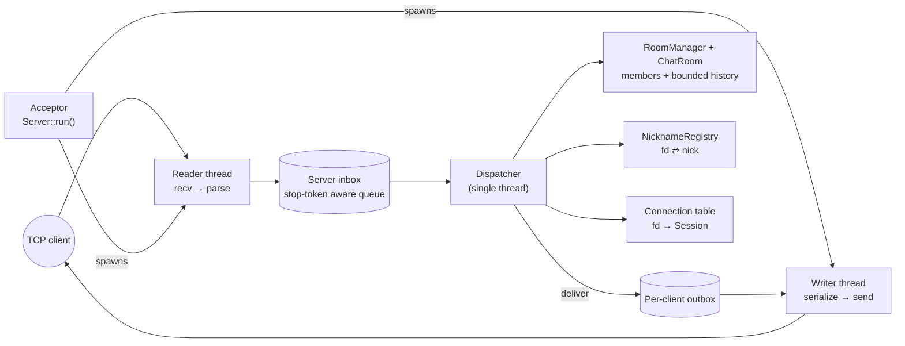
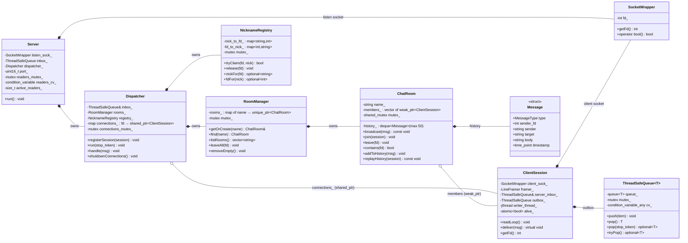
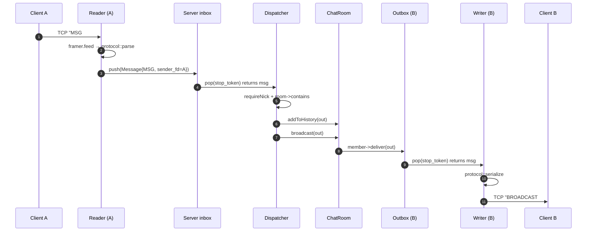

# NetPulse

A multi-threaded TCP chat server written in modern C++20: rooms, direct messages, message history, and a line-delimited wire protocol. Built to demonstrate concurrent-systems engineering — RAII socket lifetimes, a single-threaded dispatcher fed by a thread-safe queue, `std::jthread` with `stop_token` for clean teardown, and ThreadSanitizer-clean tests in a cross-platform CI matrix.

[](https://github.com/HusseinAb22/NetPulse/actions)

---

## What it does

- **Multiple chat rooms** with room-scoped broadcast (`JOIN #general` → `MSG #general hi everyone`)
- **Direct messages** between online users (`DM bob hey there`)
- **Nickname registry** — unique nicks, freed and reclaimable on disconnect, IRC-style nick change supported
- **Message history** — late joiners receive the last 50 messages of the room they join
- **Graceful shutdown** on `SIGINT` — accept loop stops, dispatcher drains, every reader is woken, every thread is joined deterministically, no leaks
- **Cross-platform** — builds and tests on Linux and macOS

## At a glance

```text
$ ./build/netpulse
server listening on port 9000 (Ctrl-C to stop)

# in another terminal:
$ nc 127.0.0.1 9000
NICK alice
OK nick alice
JOIN #general
OK joined #general
MSG #general hello everyone!

# third terminal (bob):
$ nc 127.0.0.1 9000
NICK bob
JOIN #general
BROADCAST #general alice hello everyone!      ← replayed from history
BROADCAST #general server bob joined          ← announced to existing members
DM alice secret tip
PRIVMSG alice bob secret tip                  ← what alice sees
```

## Architecture

One acceptor thread, one dispatcher thread that owns all the business state, and a `reader` + `writer` `jthread` pair per connected client. All messages flow through a single `ThreadSafeQueue` to the dispatcher, which is the only thread that ever mutates rooms / registry / the connection table — eliminating most race surface by design.



**Ownership graph.** The dispatcher's connection table is the strong owner of each `ClientSession`. The reader thread holds a strong ref so the session outlives any `recv()` in flight. `ChatRoom` members are `std::weak_ptr` so a dead session is pruned automatically on the next broadcast — no manual cleanup races.

## Class diagram



Filled diamond (`*--`) is composition (owns); empty diamond (`o--`) is aggregation (references without owning). The `ChatRoom → ClientSession` relationship being aggregation (weak_ptr) is what lets disconnected members be pruned lazily on the next broadcast — the room never has to coordinate with the disconnect path.

## Message flow



## Wire protocol

Line-delimited ASCII, one command per `\n`. Full spec in [docs/PROTOCOL.md](docs/PROTOCOL.md).

### Client → server

| Command | Example | Notes |
|---|---|---|
| `NICK <name>` | `NICK alice` | Required before any other command |
| `JOIN <#room>` | `JOIN #general` | Creates the room if it doesn't exist |
| `MSG <#room> <text>` | `MSG #general hi` | Must be a member of the room |
| `DM <nick> <text>` | `DM bob hey` | Recipient must be online |
| `LIST` | `LIST` | Server replies with `ROOMLIST` |
| `QUIT` | `QUIT` | Disconnect cleanly |

### Server → client

| Reply | Example |
|---|---|
| `OK <context>` | `OK joined #general` |
| `ERR <reason>` | `ERR nickname taken` |
| `BROADCAST <room> <sender> <text>` | `BROADCAST #general alice hi` |
| `PRIVMSG <recipient> <sender> <text>` | `PRIVMSG bob alice hey` |
| `ROOMLIST <room1> <room2> ...` | `ROOMLIST #general #random` |

## Build & run

Requires a C++20 compiler (`g++ ≥ 11` or recent Clang) and CMake ≥ 3.14. GoogleTest is fetched automatically.

```bash
git clone https://github.com/HusseinAb22/NetPulse.git
cd NetPulse
cmake -B build -DCMAKE_BUILD_TYPE=Release
cmake --build build --parallel
./build/netpulse                # listens on port 9000
```

Use any TCP client (`nc`, `telnet`, the upcoming Python client) to connect.

## Tests

```bash
./build/tests
```

Unit tests cover the queue, protocol parser/serializer, line framer, `ChatRoom`, `RoomManager`, `NicknameRegistry`, and dispatcher routing. An integration test boots the real `Server`, connects a TCP client, raises `SIGINT`, and asserts `Server::run()` returns cleanly within a timeout.

### CI

[GitHub Actions](.github/workflows/cmake_build.yml) runs the full suite on every push and PR:

- **Cross-platform matrix:** Ubuntu and macOS
- **ThreadSanitizer** build — proves no data races
- **Address + UB Sanitizer** build — proves no memory or undefined behaviour

## What's in the code

| Component | File | Role |
|---|---|---|
| `SocketWrapper` | `include/socket_wrapper.h` | RAII for socket fds — move-only, close-on-destruct |
| `ThreadSafeQueue<T>` | `include/thread_safe_queue.h` | Templated queue with a `stop_token`-aware `pop` |
| `LineFramer` | `include/line_framer.h` | Buffers a TCP byte stream until `\n`, emits whole lines |
| `protocol::parse / serialize` | `src/protocol.cpp` | Symmetric line ⇄ `Message` |
| `ClientSession` | `src/client_session.cpp` | Per-client reader/writer threads, partial-write loop |
| `ChatRoom` | `src/chat_room.cpp` | Members (`weak_ptr`) + bounded history, `shared_mutex` |
| `RoomManager` | `src/room_manager.cpp` | Owns rooms, `getOrCreate` / `leaveAll` |
| `NicknameRegistry` | `src/nickname_registry.cpp` | fd ⇄ nick bidirectional map with atomic re-claim |
| `Dispatcher` | `src/dispatcher.cpp` | Single-threaded router; one `switch` per `MessageType` |
| `Server` | `src/server.cpp` | Lifecycle: accept loop, `SIGINT` handler, ordered teardown |

## Project layout

```
NetPulse/
├── include/                     # public headers
├── src/                         # implementations
├── tests/                       # gtest suite
├── docs/PROTOCOL.md             # wire protocol spec
├── .github/workflows/           # CI: matrix build, TSAN, ASAN/UBSAN
├── .clang-format / .clang-tidy
└── CMakeLists.txt
```

## Engineering notes — what building this taught me

- **Single-writer concurrency.** Funnelling every state change through one dispatcher thread eliminates most cross-component race surface. The only synchronisation that remains is the inbox queue and the connection table, both small and easy to reason about.
- **`std::jthread` + `stop_token`** for cooperative cancellation. The writer's `pop(stop_token)` returns `std::nullopt` when the session is destroyed — no poison-pill kludges, and the bug-prone "raw `condition_variable`" path is avoided by using `condition_variable_any`, which is the only one that can wait on a stop token.
- **RAII ownership of OS handles.** `SocketWrapper` is move-only with deleted copy and `noexcept` move semantics, so leaking an fd or double-closing is statically impossible. The same idea (`jthread` joining at destruction) handles every thread.
- **Async-signal safety.** A handler may only touch a lock-free atomic and call a tiny POSIX-listed set of functions. The `SIGINT` handler sets one `std::atomic<bool>` and nothing more; the accept loop `poll()`s the listen socket with a short timeout to notice the flag. (An earlier version `shutdown()`'d the listen socket from the handler — it works on Linux but is a no-op on macOS, which the CI matrix caught.)
- **Lock granularity.** `ChatRoom::broadcast` is a pure reader (`shared_mutex` shared lock); `addToHistory` is the write. Splitting them keeps concurrent broadcasts non-exclusive without making `broadcast` mutate state.
- **Weak pointers for non-owning observers.** Rooms hold `weak_ptr<ClientSession>` so disconnected members are pruned lazily on the next broadcast — the room never needs an explicit "remove" race with the disconnect path.
- **Deterministic shutdown.** Reader threads are accounted for with a counter + condition variable; teardown waits for the count to hit zero before destroying the inbox, guaranteeing no `readLoop` is still touching it.
- **Cross-platform CI earned its keep.** The Ubuntu vs macOS matrix caught the `shutdown()`-on-a-listening-socket portability bug before it could ship.

## License

MIT — see [LICENSE](LICENSE).